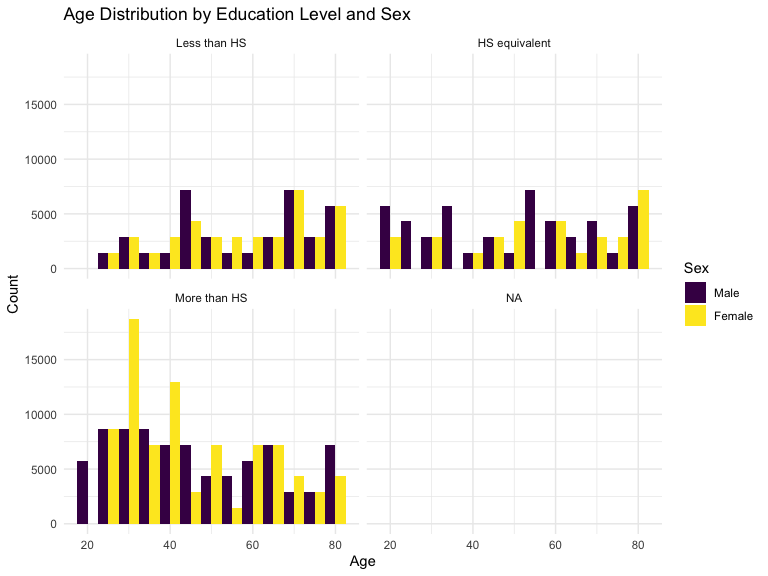
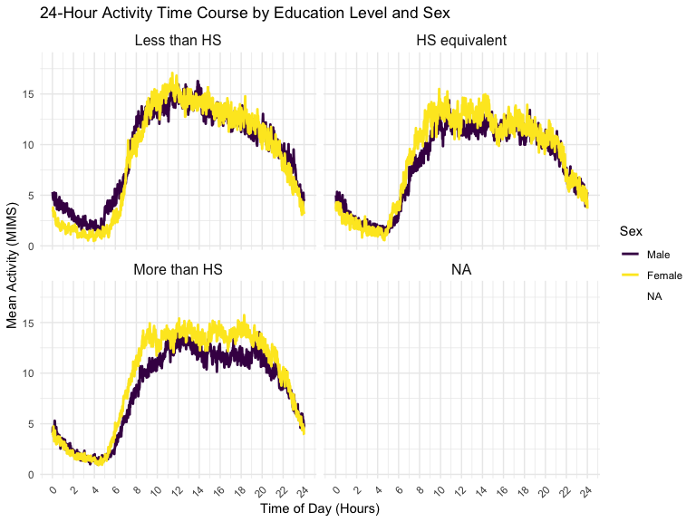

p8105_hw3_sd3730
================
Stacey Dai
2024-10-13

# Problem 1

#### Load the ny_noaa dataset

``` r
data("ny_noaa")
```

This dataset contains 2595176 rows and 7 columns. Variables include
weather station id, date of observation, (tenths of mm), snowfall (mm),
snow depth (mm), and min and max temperature (tenths of degrees C).

#### Do some data cleaning. Create separate variables for year, month, and day. Ensure observations for temperature, precipitation, and snowfall are given in reasonable units. For snowfall, what are the most commonly observed values? Why?

Below we clean the data, creating separate variables for year, month,
and day and converting `tmax` and `tmin` to numeric. We find that 0 is
the most commonly observed value for snowfall. This is because most days
of the year, it does not snow at all in NY. The second most commonly
observed value is `NA`, indicating missingness. Other common values are
13, 25, and 51, suggesting that snowfall is originally recorded in
fractions of an inch and converted to mm.

``` r
ny_noaa %>% 
  count(snow) %>%
  arrange(desc(n))
```

    ## # A tibble: 282 × 2
    ##     snow       n
    ##    <int>   <int>
    ##  1     0 2008508
    ##  2    NA  381221
    ##  3    25   31022
    ##  4    13   23095
    ##  5    51   18274
    ##  6    76   10173
    ##  7     8    9962
    ##  8     5    9748
    ##  9    38    9197
    ## 10     3    8790
    ## # ℹ 272 more rows

``` r
ny_noaa = 
  ny_noaa %>% 
  separate(date, into = c("year", "month", "day"), convert = TRUE) %>% 
  mutate(
    tmax = as.numeric(tmax),
    tmin = as.numeric(tmin))
```

#### Make a two-panel plot showing the average max temperature in January and in July in each station across years. Is there any observable / interpretable structure? Any outliers?

Below is a two-panel plot showing the average max temperature in January
and in July in each station across years.

``` r
ny_noaa %>% 
  group_by(id, year, month) %>% 
  filter(month %in% c(1, 7)) %>% 
  summarize(mean_tmax = mean(tmax, na.rm = TRUE, color = id)) %>% 
  ggplot(aes(x = year, y = mean_tmax, group = id)) + geom_point() + geom_path() +
  facet_grid(~month) +
  labs(title = "Mean monthly temperature for each station across years for January and July")
```

    ## `summarise()` has grouped output by 'id', 'year'. You can override using the
    ## `.groups` argument.


The mean temperature in January is much lower than the mean temperature
in July for all stations and across all years. All stations appear to
follow similar trends of temperature peaks and valleys within a month
across the years, i.e. when one station has a high monthly mean
temperature for a given year, most other stations also have a high
monthly mean temperature for that year. We do see one
uncharacteristically cold station in July of 1987 or 1988, as well as a
few other less drastic outliers.

#### Make a two-panel plot showing (i) tmax vs tmin for the full dataset (note that a scatterplot may not be the best option); and (ii) make a plot showing the distribution of snowfall values greater than 0 and less than 100 separately by year.

Below we show a two-panel plot including (i) a hex plot of `tmax` vs
`tmin` for the full dataset; and (ii) a ridge plot showing the
distribution of snowfall values (in mm) greater than 0 and less than 100
separately by year.

``` r
hex = 
  ny_noaa %>% 
  ggplot(aes(x = tmin, y = tmax)) + 
  geom_hex()

ridge = 
  ny_noaa %>% 
  filter(snow < 100, snow > 0) %>%
  ggplot(aes(x = snow, y = as.factor(year))) + 
  geom_density_ridges()

hex + ridge
```

    ## Picking joint bandwidth of 3.76


From the hex plot we see that while there is some variability, the
majority of the data cluster tightly in the center of the distribution.
In relatively rare cases, it seems that `tmax` is less than `tmin`,
which raises questions about data recording and quality.

From the ridge plot, we see a multimodal density of snowfall within a
given year. Most stations see between 0 and 35 mm of snow in a year.
Then there is a another group of stations that see about 45 mm of snow,
and another group that sees nearly 80 mm. It is likely this
multimodality stems from the conversion of measurements in one system
(fractions of an inch) to another (using the metric system), which was
also noted in the table of common values.

# Problem 2

#### Load the dataset

``` r
library(readr)

demographic_data = read_csv (file = "./data/nhanes_covar.csv", skip = 4)
names(demographic_data) = c("SEQN", "sex", "age", "BMI", "education")

accelerometer_data = read_csv (file = "./data/nhanes_accel.csv")
```

#### Clean and merge the datasets

We will filter out participants under 21 years of age and handle missing
values. We will also tidy the data so that it is long-form and each
observation represents a minute-by-minute MIMS reading for a
participant.

``` r
library(tidyr)

demographic_data_clean = demographic_data %>%
  filter(age >= 21) %>%
  drop_na()

accelerometer_data_long = accelerometer_data %>%
  pivot_longer(
    cols = starts_with("min"),
    names_to = "minute",
    values_to = "value"
  )
```

After cleaning both datasets, merge them on the participant ID to create
a single dataset.

``` r
library(dplyr)

merged_data = accelerometer_data_long %>%
  left_join(demographic_data_clean, by = "SEQN") %>%
  mutate(
    sex = factor(sex, levels = c(1,2), labels = c("Male", "Female")),
    education = factor(education, levels = c(1, 2, 3), 
                       labels = c("Less than HS", "HS equivalent", "More than HS"))
  )
```

#### Table of Men and Women by Education Category

``` r
library(knitr)

education_sex_table = merged_data %>%
  filter(!is.na(education)) %>%
  distinct(SEQN, .keep_all = TRUE) %>%
  count(education, sex) %>%
  pivot_wider(names_from = sex, values_from = n, values_fill = 0)

kable(education_sex_table, caption = "Number of Men and Women in Each Education Category")
```

| education     | Male | Female |
|:--------------|-----:|-------:|
| Less than HS  |   27 |     28 |
| HS equivalent |   35 |     23 |
| More than HS  |   56 |     59 |

Number of Men and Women in Each Education Category

The table shows that among participants with less than a high school
education, there are slightly more females (28) than males (27). This
suggests a relatively balanced distribution between genders in this
category. In the HS equivalent category, the male count (35) is higher
than the female count (23). This may indicate a trend where more males
than females have completed high school, though the gap is not very
large. The category with the highest counts is the “More than HS”
category, where there are 56 males compared to 59 females. This
demonstrates that women in this group slightly outnumber men. The data
suggests that a significant portion of both genders continues their
education beyond high school, with a slight female majority in higher
education. Overall, the data indicates that females are represented
slightly more in the less than HS and more than HS categories, while
males are slightly more represented in the HS equivalent category. This
could point to varying educational trends and social factors affecting
education levels by gender within this population. This distribution can
prompt further analysis into factors that influence educational
attainment, such as socioeconomic status, cultural expectations, and
access to educational resources for each gender.

#### Visualization of Age Distributions by Sex and Education

``` r
library(ggplot2)

cleaned_data = merged_data %>%
  filter(!is.na(age) & !is.na(education))

ggplot(merged_data, aes(x = age, fill = sex)) +
  geom_histogram(position = "dodge", binwidth = 5) +
  facet_wrap(~education) +
  labs(
    title = "Age Distribution by Education Level and Sex",
    x = "Age",
    y = "Count",
    fill = "Sex"
  ) +
  theme_minimal()
```



The histogram displays the age distributions of men and women across
different education levels, allowing for a comparative analysis between
sexes within each education category. In the ‘Less than HS’ category,
there are slightly more women than men, with ages primarily concentrated
in the lower age brackets. Conversely, in the ‘More than HS’ category,
men and women appear to have similar age distributions, but women are
slightly more prevalent in the older age groups.The data indicates that
younger men tend to have a higher representation in the ‘HS equivalent’
and ‘More than HS’ categories compared to women, who show a more
balanced distribution across ages in the same education levels.The age
distribution for both sexes in the ‘More than HS’ category shows a
pronounced peak around the mid-30s, suggesting that this group may be
more engaged in higher education or career advancement at that age.
Overall, this visualization underscores the importance of educational
attainment and its relationship with age demographics, providing
valuable insights for understanding the socio-economic landscape among
different genders.

#### Total Activity by Age and Education, Separated by Sex

Aggregate MIMS values to total activity for each participant

``` r
total_activity_data <- merged_data %>%
  group_by(SEQN, age, sex, education) %>%
  summarize(total_activity = sum(value, na.rm = TRUE))
```

    ## `summarise()` has grouped output by 'SEQN', 'age', 'sex'. You can override
    ## using the `.groups` argument.

Plot total activity vs age, separated by sex and education level

``` r
ggplot(total_activity_data, aes(x = age, y = total_activity, color = sex)) +
  geom_point(alpha = 0.5) +
  geom_smooth(method = "loess") +
  facet_wrap(~education) +
  labs(
    title = "Total Daily Activity by Age, Sex, and Education Level",
    x = "Age",
    y = "Total Activity (MIMS)"
  ) +
  theme_minimal()
```

    ## `geom_smooth()` using formula = 'y ~ x'


The plot illustrates total daily activity (in MIMS) against age for
different educational levels, separated by sex. Each panel represents a
unique education level category: “Less than HS,” “HS equivalent,” “More
than HS,” and “NA.” There is a noticeable decline in total daily
activity with increasing age across all education levels. This suggests
that as participants grow older, their physical activity decreases,
which aligns with common findings in physical activity research. In the
“Less than HS” and “More than HS” panels, men (represented by the dark
purple line) tend to exhibit higher total daily activity levels than
women (represented by the yellow line) throughout most age ranges.
However, in the “HS equivalent” panel, the gap between male and female
activity levels appears narrower, suggesting that educational attainment
may influence the disparity in activity levels between sexes. The trend
lines for both sexes show a consistent downward trajectory as age
increases, indicating that both men and women become less active as they
age. Notably, the younger age group (20-30 years) shows higher activity
levels, particularly for those with “More than HS” education, while
older age groups experience a significant decline. Overall, the findings
suggest that education level plays a significant role in physical
activity levels across age groups, with men generally being more active
than women. These insights can inform future health interventions aimed
at promoting physical activity, particularly targeting older adults and
addressing gender disparities in activity levels.

#### 24-Hour Activity Time Course by Education Level and Sex

Summarize MIMS values over the course of a day by hour

``` r
activity_time_course = merged_data %>%
  group_by(minute, sex, education) %>%
  summarise(mean_activity = mean(value, na.rm = TRUE)) %>%
  ungroup()
```

    ## `summarise()` has grouped output by 'minute', 'sex'. You can override using the
    ## `.groups` argument.

This is to convert the minute variable to hours.

``` r
activity_time_course = activity_time_course %>%
  mutate(hour = as.numeric(gsub("min", "", minute)) / 60)
```

This is a plot that shows the 24-hour activity time courses for each
education level and use color to indicate sex.

``` r
ggplot(activity_time_course, aes(x = hour, y = mean_activity, color = sex)) +
  geom_line(linewidth = 1) +
  facet_wrap(~education) +
  labs(
    title = "24-Hour Activity Time Course by Education Level and Sex",
    x = "Time of Day (Hours)",
    y = "Mean Activity (MIMS)",
    color = "Sex"
  ) +
  theme_minimal() +
  theme(
    strip.text = element_text(size = 12),
    axis.text.x = element_text(angle = 45, hjust = 1)
  ) +
  scale_x_continuous(breaks = seq(0, 24, by = 2))
```


The title of the graph clearly indicates the graph’s purpose, showing
the activity levels throughout a 24-hour period segmented by education
level and sex. The x-axis represents the Time of Day (Hours), ranging
from 0 to 24, while the y-axis indicates the Mean Activity (MIMS).

- Across all education levels, males tend to have higher mean activity
  levels than females, as indicated by the consistently higher purple
  line compared to the yellow line. This trend may suggest that males
  are generally more physically active than females, regardless of their
  educational background.
- The “Less than HS” group displays a clear daily activity rhythm, with
  males showing notably higher activity than females during the morning
  peak. The overall activity levels for this group are lower than those
  in the “More than HS” category.
- Similar trends are visible here, but the gap between males and females
  appears narrower than in the “Less than HS” group. This could imply
  that those with a high school equivalent education may engage in more
  balanced activity levels across genders.
- The “More than HS” panel shows both sexes maintaining higher activity
  levels throughout the day compared to the other groups, suggesting
  that individuals with higher educational attainment might be more
  active overall. The gap between males and females remains, but it is
  less pronounced than in the other categories.

Overall, this graph illustrates clear daily rhythms of physical activity
that vary by educational attainment and sex. Males consistently
demonstrate higher activity levels than females, and those with higher
educational levels appear to maintain higher activity throughout the
day.

# Problem 3

#### Import the NYC Citi Bike System data

``` r
library(lubridate)

jan2020 = read_csv("./citibike/Jan 2020 Citi.csv")
```

    ## Rows: 12420 Columns: 7
    ## ── Column specification ────────────────────────────────────────────────────────
    ## Delimiter: ","
    ## chr (6): ride_id, rideable_type, weekdays, start_station_name, end_station_n...
    ## dbl (1): duration
    ## 
    ## ℹ Use `spec()` to retrieve the full column specification for this data.
    ## ℹ Specify the column types or set `show_col_types = FALSE` to quiet this message.

``` r
jan2024 = read_csv("./citibike/Jan 2024 Citi.csv")
```

    ## Rows: 18861 Columns: 7
    ## ── Column specification ────────────────────────────────────────────────────────
    ## Delimiter: ","
    ## chr (6): ride_id, rideable_type, weekdays, start_station_name, end_station_n...
    ## dbl (1): duration
    ## 
    ## ℹ Use `spec()` to retrieve the full column specification for this data.
    ## ℹ Specify the column types or set `show_col_types = FALSE` to quiet this message.

``` r
july2020 = read_csv("./citibike/July 2020 Citi.csv")
```

    ## Rows: 21048 Columns: 7
    ## ── Column specification ────────────────────────────────────────────────────────
    ## Delimiter: ","
    ## chr (6): ride_id, rideable_type, weekdays, start_station_name, end_station_n...
    ## dbl (1): duration
    ## 
    ## ℹ Use `spec()` to retrieve the full column specification for this data.
    ## ℹ Specify the column types or set `show_col_types = FALSE` to quiet this message.

``` r
july2024 = read_csv("./citibike/July 2024 Citi.csv")
```

    ## Rows: 47156 Columns: 7
    ## ── Column specification ────────────────────────────────────────────────────────
    ## Delimiter: ","
    ## chr (6): ride_id, rideable_type, weekdays, start_station_name, end_station_n...
    ## dbl (1): duration
    ## 
    ## ℹ Use `spec()` to retrieve the full column specification for this data.
    ## ℹ Specify the column types or set `show_col_types = FALSE` to quiet this message.

``` r
citi_bike_data = bind_rows(jan2020, jan2024, july2020, july2024)
```

#### Clean and tidy the dataset

``` r
citi_bike_data = citi_bike_data %>%
  mutate(
    duration = as.numeric(duration),
    year = year(Sys.Date()),
    month = month(Sys.Date(), label = TRUE, abbr = TRUE),
    day_of_week = weekdays(as.Date(Sys.Date()))
  ) %>%
  
  filter(duration > 0 & duration < 240)
```
